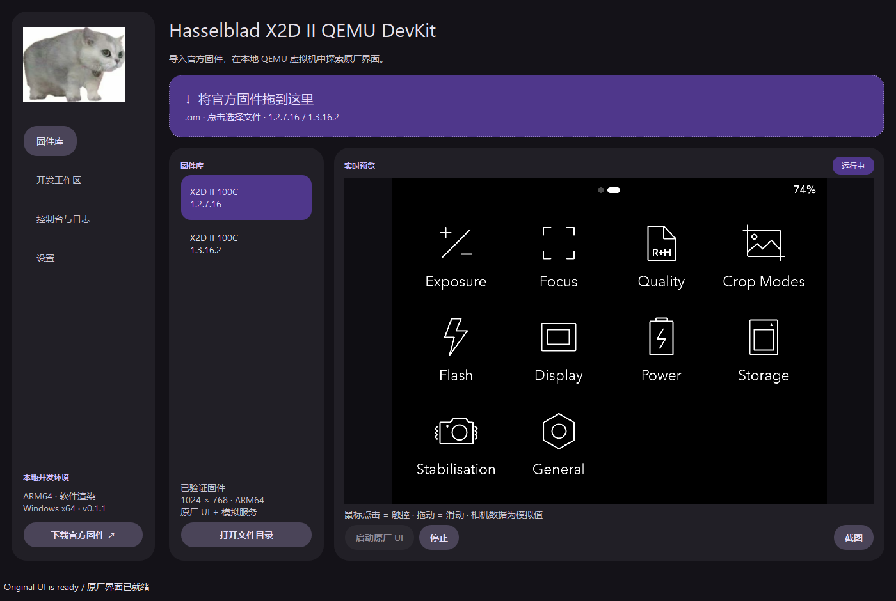

# Hasselblad X2D II QEMU DevKit

**Windows 原生工作台；也支持在 Apple Silicon Mac 上从源码运行：拖入官方固件，启动原厂界面，开发你的应用。**

[English](README.md) · [下载 Windows 便携版](https://github.com/derrickyau9/Hasselblad-X2D-II-QEMU-DevKit/releases/latest) · [哈苏官方固件](https://www.hasselblad.com/zh-cn/x-system/firmware/)



## 快速开始

1. 从 Releases 下载 **X2DII-DevKit-Windows-x64.zip**，解压后双击 **X2DII-DevKit.exe**。无需另装 Python、Qt 或 WSL。
2. 从哈苏官网下载支持版本的 **X2D II 100C `.cim` 固件**，拖入窗口，也可以点击导入区域选择文件。
3. 点击 **启动原厂 UI**。首次使用时阅读并接受 Android SDK 许可条款，程序自动下载、校验和准备运行环境，然后启动虚拟机。
4. 鼠标点击模拟触控，拖动模拟滑动。点击 **停止** 关闭该虚拟机；之后使用缓存即可离线启动。

首次运行环境下载约 **615 MB**。需要 Windows x64、建议至少 8 GB 内存、预留 **8 GB 磁盘空间**。所有运行文件放在用户目录，不需要管理员权限。

## 已实现

- 官方 `.cim` 拖拽导入、SHA-256 校验、本地固件库。
- QEMU 中原厂 UI 实时画面、鼠标触控、启动 / 停止、PNG 截图。
- 中文 / English、跟随系统 / 浅色 / 深色、紫 / 蓝 / 绿主题。
- 开发工作区、ARM64 `hello.c` 示例、NDK 编译及虚拟机运行。
- 虚拟机 Shell 控制台和日志目录。
- 每份固件独立的数据盘，系统改动使用临时快照。

## 支持范围

| 项目 | 状态 |
| --- | --- |
| Windows x64 | 支持；原生 Qt 便携程序 |
| macOS Apple Silicon | 支持从源码运行，见 [Mac 安装说明](docs/MACOS.md)；暂未提供便携包 |
| X2D II 1.2.7.16 | 原厂 UI、主菜单和 Display 子菜单已验证 |
| X2D II 1.3.16.2 | 见[验证记录](docs/VERIFICATION.md) |
| 其他固件 | 未验证的完整文件会被拒绝 |
| 渲染 | QEMU TCG CPU 模拟 + Qt Quick 软件渲染 |
| GPU / CPU 虚拟化加速 | 当前 ARM64 guest 在 x86-64 Windows 上未实现 |
| 拍摄、ISP、对焦、镜头、真实存储 | 未模拟 |
| 实机安装、刷机 | 不提供 |

运行方式是：**在 Android ARM64 开发虚拟机中运行原厂相机 UI，并提供模拟相机服务**。它没有启动相机原厂内核，也不等于完整相机硬件仿真；部分功能不会响应，数值可能为模拟值，流畅度取决于电脑 CPU。

为使图片在软件渲染下显示，程序在独立开发副本中调整两个内嵌 QML 可见性绑定。原始可执行文件保留，不修改机器指令，不回写 `.cim`。详见[架构说明](docs/ARCHITECTURE.md)。

## 开发流程

1. 导入并选中固件。
2. 打开 **开发工作区 → 打开开发工作区**，编辑 `hello.c`。
3. 选择 [Android NDK](https://developer.android.com/ndk/downloads) 目录（已验证 r27）。
4. 停止虚拟机，点击 **编译应用 → 运行应用**。
5. 示例在独立虚拟机会话中运行；停止后重新启动原厂 UI 即可返回。

仅启动原厂 UI 不需要 NDK。示例是 Android/Bionic ARM64 Wayland 共享内存客户端。开发自定义 Qt guest 应用另需兼容的 Android ARM64 Qt 工具链，本项目不附带该工具链；Windows Qt 可执行程序不能直接在虚拟机里运行。

[开发说明](docs/DEVELOPMENT.md) · [故障排查](docs/TROUBLESHOOTING.md)

## 从源码运行

安装 Python **3.11+**，克隆仓库，双击 `Launch.cmd`。首次自动建立 `.venv` 并安装依赖。

```powershell
git clone https://github.com/derrickyau9/Hasselblad-X2D-II-QEMU-DevKit.git
cd Hasselblad-X2D-II-QEMU-DevKit
.\Launch.cmd
```

用户数据默认在 `%LOCALAPPDATA%\X2DII-DevKit`。可以通过 `X2DII_DEVKIT_HOME` 环境变量或 `--home <目录>` 改位置；路径不要含英文逗号。固件、解包文件、运行时、日志和个人开发目录不提交到 Git。

在 Apple Silicon Mac 上，按[Mac 安装说明](docs/MACOS.md)准备 QEMU 和 Android 镜像，然后运行：

```sh
./Launch.sh --home "$HOME/Library/Application Support/X2DII-DevKit"
```

## 致谢和许可证

- **[Radium Wang / radium-wang — Hasselblad X-System CIM Firmware Research & Feature Extensions](https://github.com/radium-wang/Hasselblad-X-System-CIM-Firmware-Research-Feature-Extensions)**：为 CIM 固件离线分析、原厂 UI 与菜单扩展研究提供了参考。感谢 Radium 公开分享相关研究成果。
- **[Derrick Yao / tsla-infotainment-lab](https://github.com/derrickyau9/tsla-infotainment-lab)**：Material 主题及 Qt 工作台设计来源，保留 MIT 版权声明。参考版本 `f590d8fd9a053ab072df94b994c0a58ee7b976ed`。
- 基于 Derrick Yao 已有的 X2D II QEMU / UI 研究及 CIM 离线容器工具。
- QEMU、Stefan Weil 的 Windows 构建、Android / AOSP、Qt for Python、7-Zip、Dissect 等开源项目。

DevKit 使用 **AGPL-3.0-or-later**，满足 Dissect 文件系统依赖的许可证要求；改编的主题保留原 MIT 声明。便携包附带项目源码和第三方许可，Qt 动态库可独立替换。详见[第三方声明](THIRD_PARTY_NOTICES.md)。

哈苏固件、字体、图片、动态库及商标归各自权利人所有，**不随仓库或发布包分发**。用户自行提供官方固件。本项目与哈苏无隶属或背书关系。

## 免责声明

本项目按“现状”提供，不作任何保证。使用及修改产生的风险由使用者自行承担；**如导致保修失效、相机损坏、数据丢失或其他损失，后果自负**。DevKit 本身只运行本地虚拟机，不提供实机安装或刷写功能。
