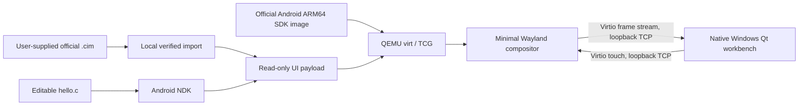

# Architecture / 架构



## Data ownership

The original `.cim` is read only. Import identifies a known package by SHA-256,
reads its full OTA component, expands the Android block transfer data and reads
the ext4 filesystem locally. Only the original UI's dependency closure, fonts,
XKB files and product configuration enter its local payload. Intermediate files
are discarded when import completes or fails.

No camera or host disk is passed through. QEMU networking is disabled. The
console, input and display transports bind to `127.0.0.1` on ephemeral ports.
These local development endpoints are not authenticated; other processes on the
same computer may access them. They must never be rebound to public interfaces.
The guest console is the SDK image's built-in development console.

SDK system/vendor images remain read-only backing files. Qcow2 overlays rename
their GPT labels for the SDK kernel's virtio layout. QEMU discards system writes
on exit. Userdata and the encryption-key disk belong exclusively to the selected
import. A file lock prevents two sessions from writing the same guest disks.

The frame disk is disposable and uses `cache=unsafe` only for fallback frame
storage; userdata does not use that setting. Normal frames stream over virtio.

## Original UI rendering adaptation

`software_ui.py` creates a separate copy of `camera-gui`. Two equal-length
embedded QML source substitutions make `HblImage` use its ordinary Image rather
than a GPU ShaderEffect. The guest sets `QT_QUICK_BACKEND=software` and
`QML_DISABLE_DISK_CACHE=1`. Source and output hashes and byte offsets are recorded
next to the development copy. Executable instructions remain unchanged.

This is only a rendering adaptation in the disposable guest. The tool does not
modify bootloaders, original kernels, SELinux policy or a connected camera.

## Services and development

`mock_services.c` provides initial D-Bus properties for UI startup. Methods which
have no simulation return NotSupported. Battery, hardware and storage values are
not physical camera measurements. A working menu does not imply working capture,
AF, media management, upgrade or network functionality.

The minimal compositor supports the protocols required by this UI and the
included `wl_shm` example. It is not a complete general-purpose Wayland desktop.
The app example and original UI run in separate sessions; they are not injected
into a live camera interface.

## Paths

```text
%LOCALAPPDATA%/X2DII-DevKit/
  preferences.json             language, theme, optional NDK path
  runtime.json                 selected runtime paths
  downloads/                   checksum-verified official archives
  runtime/                     extracted QEMU, Android SDK, 7-Zip
  library/<firmware-sha-prefix>/
    device.json                version + package digest
    payload-stage/             read-only virtual FAT contents
    workspace/                 user-owned source edits
    userdata-qemu.img          private data disk
    system-name.qcow2          disposable system backing overlay
    vendor-name.qcow2          vendor backing overlay
    console.log / qemu.log     local diagnostic output
```

Runtime paths are kept stable because qcow2 overlays reference their backing
files. If moving the runtime, use a fresh DevKit data directory and re-import.
Keep your development workspace backed up separately.

## Multi-model adapters

- X2D / X2D II use Android ARM64 libraries and the static `wayland-egl` Qt platform plugin with the Qt Quick software backend.
- X1D II / CFV II 50C use the firmware's Android ARM32 linker and libraries under the SDK kernel's ARM32 compatibility mode. A guest-only ION adapter allocates ordinary tmpfs buffers. The compositor implements Eagle shared-memory tokens and accepts only regular buffers owned by the connected Wayland client. Early firmware sends byte strides; later firmware sends pixel strides.
- X1D imports the legacy bzip2 root filesystem. A separate guest disk contains a Linux ARMhf chroot plus pinned Debian Bullseye Qt 5.15 libraries. No package installation scripts execute on the host. Root filesystem symlinks exist only inside the guest tar; the build sysroot materializes library/header links as regular files on Windows.
- X1D's compressed root QML Item is adapted into a Window, allowing Qt 5.15 to expose its nested camera windows. The original executable is retained. The adapted resource stays within its original byte allocation; ELF machine instructions are unchanged.
- The compositor selects the primary camera window, retains pixels outside each surface's damage regions, and exposes touch plus a minimal F1–F5/Escape keyboard. Presentation, buffer release and frame callbacks occur on a 16 ms display tick; resource destruction removes pending releases. X1D uses 640×480; other profiles use 1024×768. This is not a general desktop compositor.
- Shared X1D II / 907X 50C firmware is imported once. Model selection controls the guest hardware identity and is saved with the library entry. Guest settings and the source workspace belong to that entry.

Linux package URLs, sizes and SHA-256 digests are pinned in `devkit/linux-downloads.json`. Debian copyright notices remain under `/usr/share/doc` inside the guest runtime. The original firmware, SDK image and downloaded libraries are excluded from repository and portable distribution.
